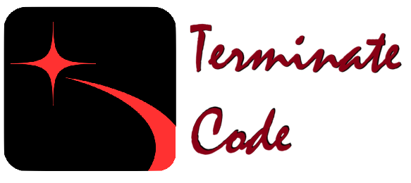
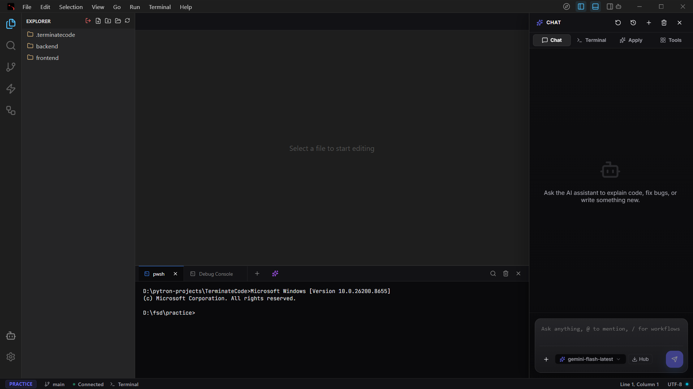

# 💀 TerminateCode



**A high-performance, AI-native IDE built on the [Pytron](https://github.com/Ghua8088/pytron) engine.**

### ⚡ The "Agentic" Shift
TerminateCode isn't just a text editor; it's a collaborative environment where the **Agentic Autonomous Engine** works alongside you. By bridging a high-performance React/Monaco frontend with a robust Python backend, TerminateCode provides a "cutting-edge" development experience with zero bloat.



---

## 🧠 AI-Native Features (Agentic Core)

TerminateCode now features the **Agentic Autonomous Engine**, upgraded with advanced situational awareness:

- **Autonomous Troubleshooting**: The AI can read your project map, search for code patterns via Regex, and diagnose issues proactively.
- **Surgical Code Patching**: Instead of overwriting files, the agent applies precision diff-patches to your code.
- **Contextual Memory**: A persistent long-term memory system allows the agent to remember project decisions, architecture, and "Todos" across sessions.
- **Git Intelligence**: Built-in tools for visualizing `git diff`, checking `git status`, and reviewing commit history.
- **Multi-Model Support**: Native integration with Google Gemini (2.0 Flash/Pro), OpenAI, and Anthropic.

## 🚀 Key Advantages

- **Powered by Pytron**: Leverages a native Python bridge for lightning-fast file IO and system access.
- **Monaco Editor Core**: Uses the same industrial-strength editing engine as VS Code.
- **Zero-Latency UI**: React-based frontend with glassmorphic aesthetics and smooth animations.
- **Lightweight Footprint**: No heavy Electron overhead—stays fast even on large projects.

## 🛠️ Getting Started

### Prerequisites
- Python 3.10+
- Node.js & npm
- `pytron-kit` installed (`pip install pytron-kit`)

### Installation

1. **Clone & Enter**
   ```bash
   git clone https://github.com/yourusername/TerminateCode.git
   cd TerminateCode
   ```

2. **Backend Setup**
   ```bash
   # We recommend a venv
   python -m venv env
   .\env\Scripts\activate
   pip install -r requirements.txt
   ```

3. **Frontend Setup**
   ```bash
   cd frontend
   npm install
   ```

### Running the App

To start development with **Hot-Reloading** (backend + frontend sync):

```bash
pytron run --dev
```

## 📦 Distribution
Pytron makes packaging a breeze. Build a professional Windows installer (`.exe`) with a single command:

```bash
pytron package --installer
```

---

## 📂 Project Anatomy

- `app.py`: The central hub for API routing and lifecycle management.
- `backend/services/`: The autonomous brain (Model Management, AI Service, Agent Tools).
- `frontend/src/`: Premium React components and the Monaco editor integration.
- `settings.json`: Global Pytron configuration.

---

*Built with ❤️ by developers, for developers, using [Pytron](https://github.com/Ghua8088/pytron).*